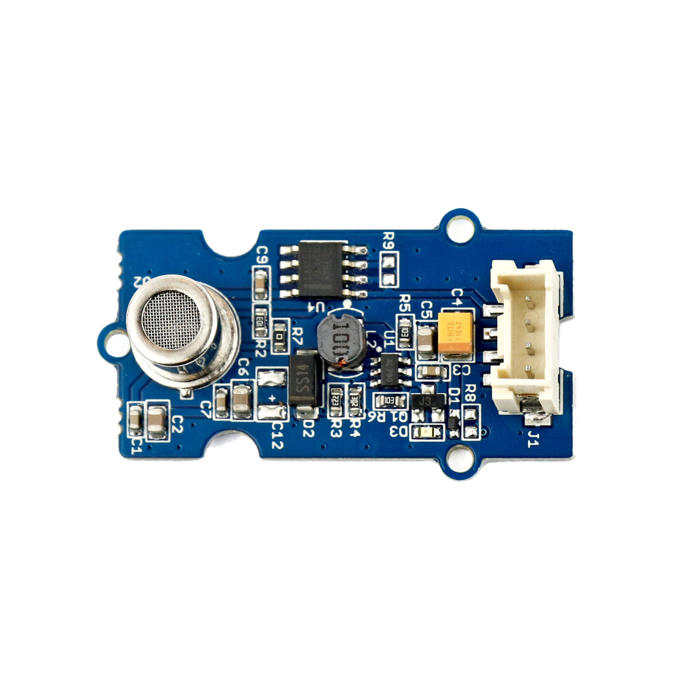

# Luftqualitätssensor



## Beschreibung
Der Luftqualitätssensor erfasst unterschiedlich auftretende, toxische Gase, wie beispielsweise Kohlenmonoxid, Alkohol, Aceton und Thinner. Jedoch ermöglicht das Messprinzip keine exakten (quantitativen) Angaben über die vorhandenen Gaskonzentrationen. Allerdings reicht der Sensor aus, um deren Präsenz qualitativ in vier groben Konzentrationsstufen einzuteilen.

Der Sensor wird direkt oder mithilfe des Grove Shields an einen Arduino angeschlossen. Der Sensor benötigt hierfür nur einen analogen Pin.

Der Luftqualitätssensor kann beispielsweise zur Realisierung eines Raumerfrischers eingesetzt werden.

Alle weiteren Hintergrundinformationen sowie ein Beispielaufbau und notwendigen Programmbibliotheken sind auf dem offiziellen Wiki (bisher nur in englischer Sprache) von Seeed Studio zusammengefasst. Zusätzlich findet man über alle gängigen Suchmaschinen durch die Eingabe der genauen Komponentenbezeichnung entsprechende Projektbeispiele und Tutorials.


## Beispiel

schau dir das Minimal-Beispiel an:

```c++:public/mks/parts/mks-SeeedStudio-Grove_Air_Quality_Sensor_v1.3/examples/Grove_Air_Quality_Sensor_v1.3_minimal/Grove_Air_Quality_Sensor_v1.3_minimal.ino
// look in the linked file.
```

<!-- infolist -->

## Wichtige Links für die ersten Schritte:

- [Seeed Studio Wiki](http://wiki.seeedstudio.com/Grove-Air_Quality_Sensor_v1.3/) [- Luftqualitätssensor](http://wiki.seeedstudio.com/Grove-Air_Quality_Sensor_v1.3/)

## Weiterführende Hintergrundinformationen:

- [GPIO - Wikipedia Artikel](https://de.wikipedia.org/wiki/Allzweckeingabe/-ausgabe)
- [GitHub-Repository: Luftqualitätssensor](https://github.com/MakeYourSchool/9-Luftqualitaetssensor)


